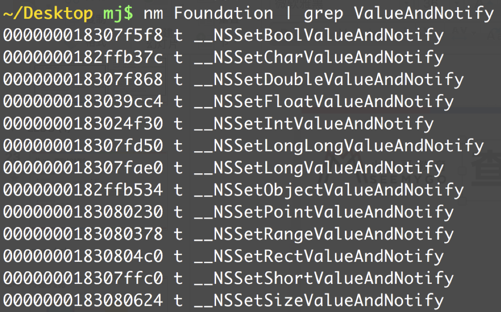
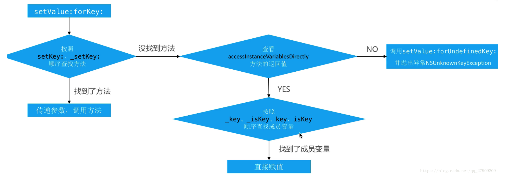
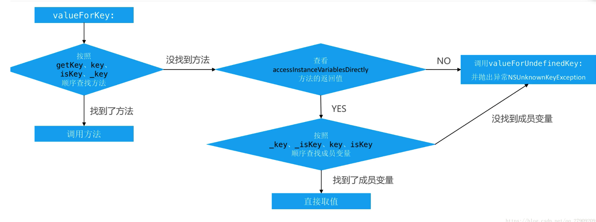
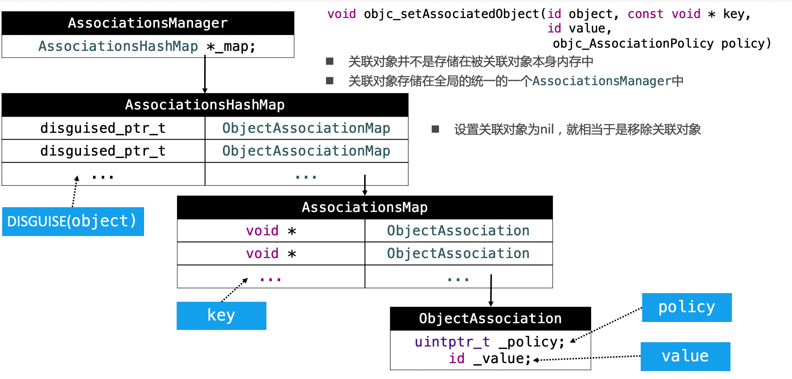
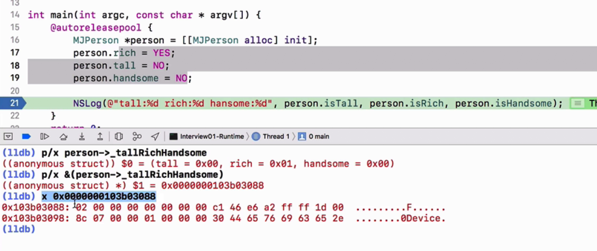

### 面试题集合
#####  一个NSObject对象的占用内存是多少？

* 系统分配了16个字节给NSObject对象（通过malloc_size函数获得）
* 但NSObject对象内部只使用了8个字节的空间（64bit环境下，可以通过class_getInstanceSize函数获得


##### 创建一个实例对象，至少需要多少内存？

```
#import <objc/runtime.h>
class_getInstanceSize([NSObject class]);
```

##### 创建一个实例对象，实际上分配了多少内存？


```
#import <malloc/malloc.h>
malloc_size((__bridge const void *)obj);
```

#### 对象的isa指针指向哪里？
* instance对象的isa指向class对象
* class对象的isa指向meta-class对象
* meta-class对象的isa指向基类的meta-class对象

判断对象是否元类对象


#### OC的类信息存放在哪里？
* 对象方法、属性、成员变量、协议信息，存放在class对象中
* 类方法，存放在meta-class对象中
* 成员变量的具体值，存放在instance对象


#### iOS用什么方式实现对一个对象的KVO？(KVO的本质是什么？)
* 利用RuntimeAPI动态生成一个子类，并且让instance对象的isa指向这个全新的子类

* 当修改**instance**对象的属性时，会调用**Foundation**的**_NSSetXXXValueAndNotify**函数
* willChangeValueForKey:
* 父类原来的setter
* didChangeValueForKey:
* 内部会触发监听器（Oberser）的监听方法( observeValueForKeyPath:ofObject:change:context:）


##### 查看_NSSet*AndNotify的存在
**nm 指令**



这个命令列出目标文件的符号。如果没有指定目标文件，默认是a.out。
#### 如何手动触发KVO？
* 手动调用willChangeValueForKey:和didChangeValueForKey:

#### 直接修改成员变量会触发KVO么？
* 不会触发KVO


#### 通过KVC修改属性会触发KVO么？
* 会触发KVO

#### KVC的赋值和取值过程是怎样的？原理是什么？
**setValue: forkey:**


**valueForKey:**



#### Category的使用场合是什么？
1. 声明私有方法 (.m文件中)
2. 分解体积庞大的类文件
3. 把Framework的私有方法公开

#### Category的实现原理
Category编译之后的底层结构是struct category_t，里面存储着分类的对象方法、类方法、属性、协议信息
在程序运行的时候，runtime会将Category的数据，合并到类信息中（类对象、元类对象中）


```
通过Runtime加载某个类的所有Category数据

把所有Category的方法、属性、协议数据，合并到一个大数组中
后面参与编译的Category数据，会在数组的前面

将合并后的分类数据（方法、属性、协议），插入到类原来数据的前面
```

源码解读顺序
objc-os.mm

* _objc_init
* map_images
* map_images_nolock

objc-runtime-new.mm
* _read_images
* remethodizeClass
* attachCategories
* attachLists
* realloc、memmove、 memcpy


#### Category和Class Extension的区别是什么？
Class Extension在编译的时候，它的数据就已经包含在类信息中
Category是在运行时，才会将数据合并到类信息中

**详细参见:Category相关的面试题**

#### Category中有load方法吗？load方法是什么时候调用的？load 方法能继承吗？

* 有load方法
* load方法在runtime加载类、分类的时候调用
* load方法可以继承，但是一般情况下不会主动去调用load方法，都是让系统自动调用

##### objc4源码解读过程：objc-os.mm

```c
_objc_init

load_images

prepare_load_methods
schedule_class_load
add_class_to_loadable_list
add_category_to_loadable_list

call_load_methods
call_class_loads
call_category_loads
(*load_method)(cls, SEL_load)
```
+load方法是根据方法地址直接调用，并不是经过objc_msgSend函数调用


#### load、initialize方法的区别什么？它们在category中的调用的顺序？以及出现继承时他们之间的调用过程？

* 1.调用方式
1> load是根据函数地址直接调用
2> initialize是通过objc_msgSend调用

* 2.调用时刻
1> load是runtime加载类、分类的时候调用（只会调用1次）
2> initialize是类第一次接收到消息的时候调用，每一个类只会initialize一次（父类的initialize方法可能会被调用多次）


```c
objc4源码解读过程
objc-msg-arm64.s
objc_msgSend

objc-runtime-new.mm
class_getInstanceMethod
lookUpImpOrNil
lookUpImpOrForward
_class_initialize
callInitialize
objc_msgSend(cls, SEL_initialize)

```
#### load、initialize的调用顺序？
* 1.load

```
1> 先调用类的load
a) 先编译的类，优先调用load
b) 调用子类的load之前，会先调用父类的load

 2> 再调用分类的load
 a) 先编译的分类，优先调用load
```

* 2.initialize

```
1> 先初始化父类
2> 再初始化子类（可能最终调用的是父类的initialize方法）
```


##### +initialize和+load的很大区别是

```
+initialize是通过objc_msgSend进行调用的，所以有以下特点
如果子类没有实现+initialize，会调用父类的+initialize（所以父类的+initialize可能会被调用多次）
如果分类实现了+initialize，就覆盖类本身的+initialize调用

```


#### Category能否添加成员变量？如果可以，如何给Category添加成员变量？

不能直接给Category添加成员变量，但是可以间接实现Category有成员变量的效果

#### 关联对象的原理



#### 相关指令

##### OC转换为C/C++

```
xcrun  -sdk  iphoneos  clang  -arch  arm64  -rewrite-objc  OC源文件  -o  输出的CPP文件
```
*如果需要链接其他框架，使用-framework参数。比如-framework UIKit*

##### LLDB指令

* print、p：打印
* po：打印对象

读取内存
* memory read/数量格式字节数  内存地址
* x/数量格式字节数  内存地址

```
memory read 0x10010
x/3xw  0x10010
```




`p/x person->isa`
```
格式
x是16进制，f是浮点，d是10进制

字节大小
b：byte 1字节，h：half word 2字节
w：word 4字节，g：giant word 8字节
```


修改内存中的值

* memory  write  内存地址  数值

```
memory  write  0x0000010  10
```


