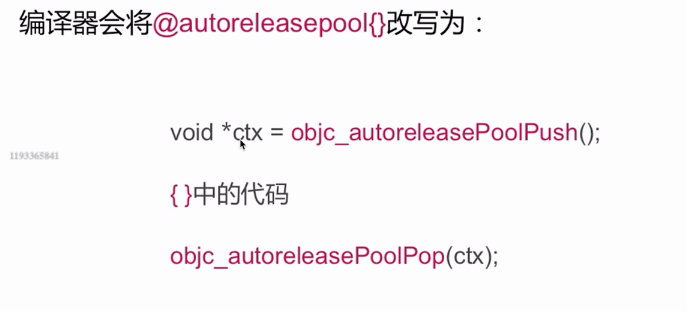
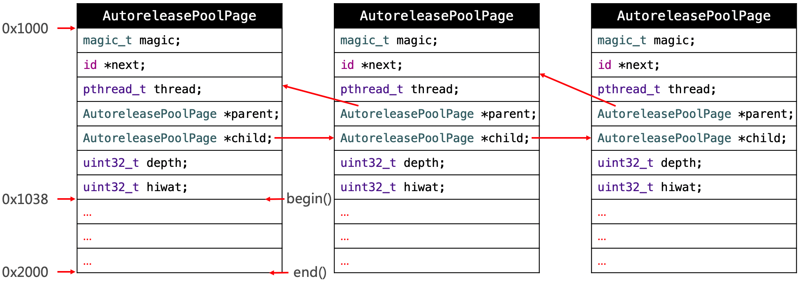

### [自动释放池相关](https://github.com/draveness/analyze/blob/master/contents/objc/%E8%87%AA%E5%8A%A8%E9%87%8A%E6%94%BE%E6%B1%A0%E7%9A%84%E5%89%8D%E4%B8%96%E4%BB%8A%E7%94%9F.md)

#### Autoreleasepool的实现原理
* 每个AutoreleasePoolPage对象占用4096字节内存，除了用来存放它内部的成员变量，剩下的空间用来存放autorelease对象的地址
* 所有的AutoreleasePoolPage对象通过双向链表的形式连接在一起



 
 
 
 
*  调用push方法会将一个POOL_BOUNDARY入栈，并且返回其存放的内存地址

* 调用pop方法时传入一个POOL_BOUNDARY的内存地址，会从最后一个入栈的对象开始发送release消息，直到遇到这个POOL_BOUNDARY

* `id *next`指向了下一个能存放autorelease对象地址的区域  

##### objc_autoreleasePoolPush


##### objc_autoreleasePoolPop


#### Autoreleasepool的数据结构


 
 
 
 
 
 

##### objc autorelease 流程

 
 
#### AutoReleasePoolPage:Pop


#### 面试点
什么时候自定释放池释放？
为什么可以多层嵌套？
应用场景？


##### Runloop和Autorelease

**iOS在主线程的Runloop中注册了2个Observer**


```
第1个Observer监听了kCFRunLoopEntry事件，会调用objc_autoreleasePoolPush()

第2个Observer
监听了kCFRunLoopBeforeWaiting事件，会调用objc_autoreleasePoolPop()、objc_autoreleasePoolPush()
监听了kCFRunLoopBeforeExit事件，会调用objc_autoreleasePoolPop()
```


可以通过以下私有函数来查看自动释放池的情况

```c
extern void _objc_autoreleasePoolPrint(void);
```
