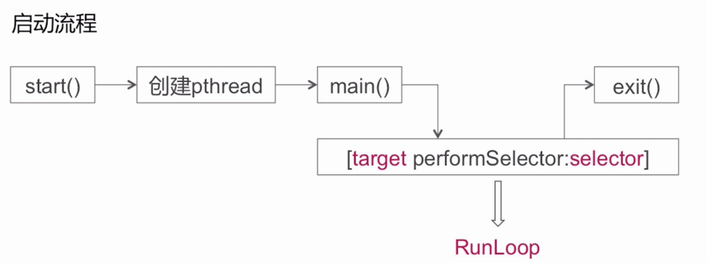

### NSTread相关

 

通过GNU-Step源码分析,可以看出在 NSTread 的start方法中,首先会经历一系列的判断,然后通过 **pthread_create(&pthreadID, &attr, nsthreadLauncher, self)** 方法创建线程.


```c++
static void *
nsthreadLauncher(void *thread)
{
  NSThread *t = (NSThread*)thread;

  setThreadForCurrentThread(t);

  /*
   * Let observers know a new thread is starting.
   */
  if (nc == nil)
    {
      nc = RETAIN([NSNotificationCenter defaultCenter]);
    }
  [nc postNotificationName: NSThreadDidStartNotification
		    object: t
		  userInfo: nil];

  [t _setName: [t name]];

  [t main];

  [NSThread exit];
  // Not reached
  return NULL;
}
```
在线程启动函数`nsthreadLauncher`方法中, 首先获取当前线程t，然后发送通知告诉当前线程已经启动了。

然后设置线程的名字,调用线程的`main`方法.
之后线程关闭。


```c
- (void) main
{
  if (_active == NO)
    {
      [NSException raise: NSInternalInconsistencyException
                  format: @"[%@-%@] called on inactive thread",
        NSStringFromClass([self class]),
        NSStringFromSelector(_cmd)];
    }

  [_target performSelector: _selector withObject: _arg];
}
```
在`main`方法中,执行线程传进来的selector。也就是说 如果我们在selector中不做任何处理,当前线程就会就此结束。 如果我们想要实现线程的常驻,则需要在selector里面做一些处理。

