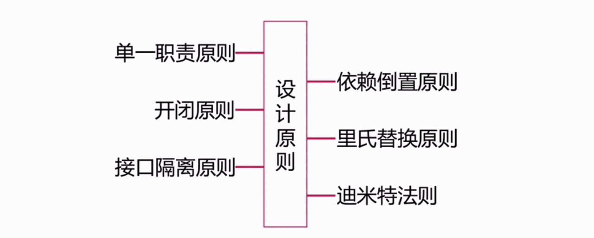

### 六大设计原则
 
 

#### 单一职责原则
一个类只做一件事
例如:View处理交互,layer处理绘制

#### 开闭原则
对修改关闭,对扩展开放

#### 接口隔离原则
使用多个专门庞大的协议,而不是一个庞大臃肿的协议。
协议中的方法尽量的少

#### 依赖倒置原则
抽象不应该依赖于具体的实现,具体实现可以依赖抽象。

#### 里氏替换原则
父类可以被子类无缝替换,且原有功能不受影响。  （KVO）

#### 迪米特法则
一个对象应当对其他对象有尽可能少的了解

高内聚、低耦合

